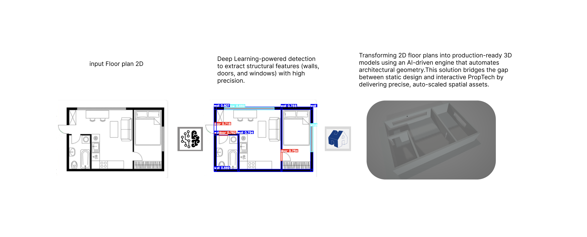
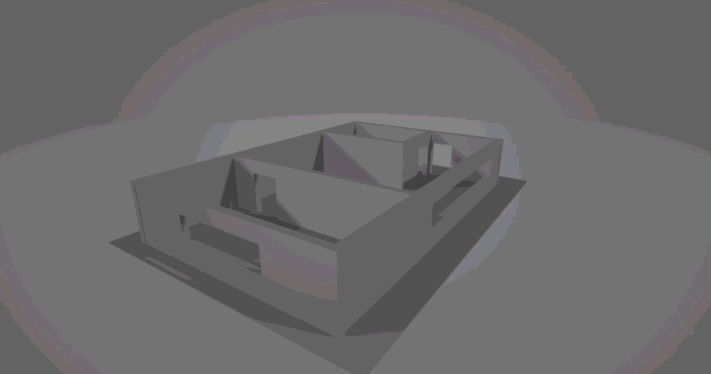

Floorplan2Mesh-YOLOv8: 2D to 3D Floorplan Reconstruction 🏠🏗️

An end-to-end pipeline that transforms 2D floorplan images into interactive 3D models. This project leverages YOLOv8L for high-precision architectural element detection and Trimesh/PyVista for procedural 3D mesh generation.

<p align="center">
  
</p>

## 🚀 Key Features

- **Deep Learning Detection**: Uses a custom-trained YOLOv8L model (27M parameters) to identify walls, doors, and windows.
- **Optimized Inference**: Powered by ONNX Runtime for fast, hardware-agnostic model execution.
- **Procedural 3D Building**: Automatically calculates wall geometry, creates openings for doors/windows, and generates a 3D scene.
- **Interactive Visualization**: High-quality 3D rendering with edge highlighting using PyVista.
- **Automated Workflow**: Integrated with Roboflow for seamless dataset management.

## 📂 Project Structure

```
Floorplan223D/
├── weights/                  # ONNX model weights (best.onnx)
├── scripts/                  # Training scripts
│   └── train_yolovl.ipynb    # Model training notebook
├── main.py                   # Core 3D reconstruction & visualization logic
├── requirements.txt          # Dependency list
└── Readme.md                 # Documentation
```

## 🛠️ Technical Specifications

- **Architecture**: YOLOv8L (Large)
- **Input Resolution**: 616x616
- **Dataset**: CubiCasa5k (via Roboflow)
- **3D Engine**: Trimesh (Mesh processing) & PyVista (Visualization)
- **Export Format**: .obj (Compatible with Blender, Unity, and 3ds Max)

## 🔧 Installation & Setup

### 1. Clone the Repository

```bash
git clone https://github.com/AbdoSaba/Floorplan223D.git
cd Floorplan223D
```

### 2. Install Dependencies

```bash
pip install -r requirements.txt
```

### 3. Download the Pre-trained Weights

The `weights/best.onnx` model is required to run the inference. You have two options:

**Option A: Use Pre-trained Weights**
- Download `best.onnx` from the releases or contact support
- Place it in the `weights/` folder

**Option B: Train Your Own Model**
- Follow the training notebook: `scripts/train_yolovl.ipynb`
- Export the trained model to ONNX format
- Place the exported model in `weights/best.onnx`

### 4. Run the Reconstruction

```bash
python main.py
```

The script will prompt you for:
- **Image Path**: Path to your floorplan image
- **Real Width**: The actual width of the floorplan in millimeters (default: 3000)
- **Wall Height**: Height of walls in millimeters (default: 450)
- **Wall Thickness**: Thickness of walls in millimeters (default: 50)

## 📊 Training Pipeline

The model was fine-tuned on the CubiCasa5k dataset using:

- **Optimizer**: AdamW
- **Learning Rate**: 0.01 (initial), 0.01 (final)
- **Epochs**: 100
- **Batch Size**: Auto
- **Augmentations**: Mosaic (1.0), Mixup (0.1)
- **Input Size**: 616px (Padding maintained for architectural accuracy)
- **Patience**: 50 (early stopping)

### Training Setup

To train your own model:
1. Open `scripts/train_yolovl.ipynb` in Jupyter Notebook
2. Configure your Roboflow API key
3. Run all cells to start training
4. The trained model will be saved in the `Floorplan_Project/YOLOv8L_CubiCasa/` directory
5. Export to ONNX format as shown in the notebook

## 🖼️ Results & Visualization

The system processes a 2D image, detects structural components, and extrudes them into a 3D space with real-world scale approximations.

### Output Features

- **Walls**: Generated with custom thickness and height
- **Doors**: Automatically creates full-height openings (75% of wall height)
- **Windows**: Creates openings at mid-height (35-75% of wall height)
- **Floor**: Auto-generated base for visualization
- **Export**: Final scene exported as `.obj` file

### Visualization

The script generates an interactive 3D plot with:
- Walls in beige (#F5F5DC) with brown edges (#8B4513)
- Floor in dark gray (#404040)
- ISO camera view for better perspective

## 📋 Requirements

See `requirements.txt` for all dependencies:
- ultralytics (YOLOv8)
- onnxruntime (ONNX model execution)
- opencv-python (Image processing)
- numpy (Numerical operations)
- pyvista (3D visualization)
- trimesh (3D mesh processing)
- roboflow (Dataset management)
- rtree (Spatial indexing)

## 🔍 Troubleshooting

### Model Not Found
- Ensure `weights/best.onnx` exists in the project directory
- Check the file path is correct

### Image Processing Errors
- Verify the image is a valid floorplan format (JPG, PNG)
- Ensure the image has reasonable dimensions

### Low Detection Accuracy
- Verify the image resolution and clarity
- Adjust confidence threshold in `main.py` (CONF_THRESH)

## 📄 License

This project is licensed under the MIT License - see LICENSE file for details.

## 🙏 Acknowledgments

- YOLOv8 by Ultralytics
- CubiCasa5k dataset by Roboflow
- Trimesh & PyVista communities

- 
<p align="center">
  
</p>
